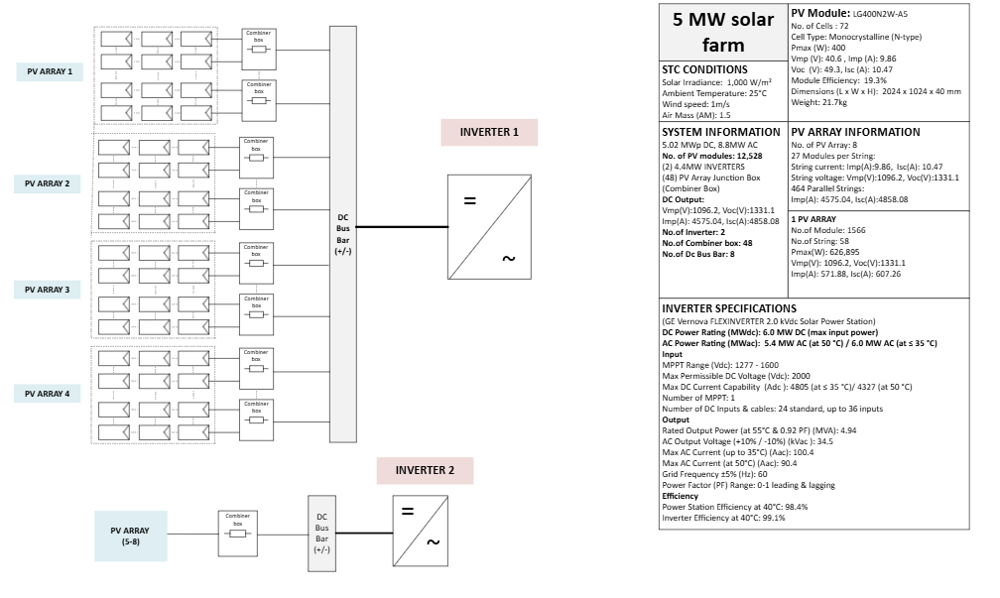

# Solar-PV-Shading-Detection-and-Automatic-Reconfiguration-System
This project develops a hardware-based system to detect partial and full shading in solar PV arrays using current sensors and a microcontroller. Relay-based bypass switching automatically reconfigures the system to reduce power loss and improve efficiency under varying shading conditions.

## 🌞 System Architecture (Baseline Design - 5 MW Solar Farm)

*Fig.1: 5 MW solar PV baseline system developed in Visio based on industry references.*

### 📐 Design Overview
- Developed using Microsoft Visio  
- Based on component research and real-world solar farm references  
- Represents a multi-array PV system with:
  - Combiner boxes  
  - DC bus bar  
  - Grid-connected inverters  

### 🔌 PV Array Configuration
- Each PV array consists of multiple panels connected in series (strings)  
- Multiple strings are combined through combiner boxes  
- Combiner boxes:
  - Aggregate current from multiple strings  
  - Provide protection for the system  

### ⚡ DC Power Collection
- Combined DC output is delivered to a centralized DC bus bar  
- DC bus bar acts as the main power collection and distribution point  
- Collects power from multiple PV arrays  

### 🔄 Power Conversion
- DC power is supplied to the inverter stage  
- Inverter converts DC → AC power  
- AC power is suitable for grid connection or load usage  

### 🏭 Grid Integration
- After inversion, a transformer steps up the voltage  
- Higher voltage enables efficient power transmission  
- Power is then integrated into the electrical grid  

### 🎯 Purpose in This Project
- Reflects standard industry practices in large-scale PV systems  
- Used as a reference for:
  - Shading detection  
  - Automatic reconfiguration strategies  
- Provides a foundation for intelligent control at:
  - String level  
  - Module level  

### 🧠 Scope Note
- This design primarily focuses on the DC side of the system  
- Also considers AC conversion and grid integration for completeness  

## 🔧 Hardware Prototype

The hardware prototype was developed to implement and validate the shading detection and automatic reconfiguration concept at a small scale.

### ⚙️ System Configuration
- 18 photovoltaic (PV) panels total  
- 3 parallel strings  
- 6 panels connected in series per string  

### 🔌 Main Components
- Relay-based bypass switching for panel-level control  
- Current sensors for each string (real-time monitoring)  
- MPPT charge controller and battery for energy storage  
- Buck converter to step down battery voltage for MCU power  
- Resistive load for testing and stable current measurement  
- LED indicators to show relay status  

### 🌡️ Cooling System
- 2 fans used as cooling load  
- Separate microcontroller for fan control  
- DHT11 temperature sensor  
- Fans automatically turn on when temperature exceeds 26°C  

### ☀️ Testing Setup
- Artificial light sources used to simulate sunlight  
- Enables indoor testing due to system size and mobility limitations  

### 🔄 Operating Modes
- **Normal Mode:**  
  - PV arrays connected to MPPT controller  
  - Battery charging operation  

- **Test Mode:**  
  - PV system connected to resistive load  
  - Enables accurate current measurement  
  - Used for shading detection and relay control  

### 🧠 Shading Detection Logic
- Test one string at a time by isolating the other two strings  
- For each string:
  - Toggle bypass switches ON/OFF  
  - Monitor current variation to detect shaded panels  
- Once detected:
  - Bypass shaded panels  
  - Maintain bypass for ~1 minute  
- System continuously rechecks conditions (loop operation)  

### ✅ Key Outcome
- Demonstrates real-time shading detection  
- Enables dynamic reconfiguration of PV system  
- Improves performance under partial and full shading conditions

*Figure: Hardware prototype of the solar PV shading detection and automatic reconfiguration system.*
## 🎥 Demo  
